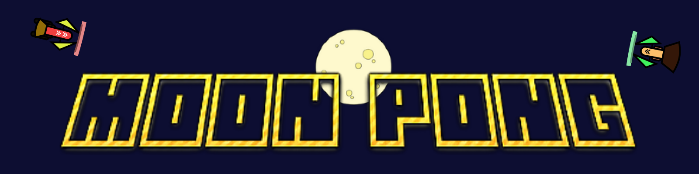

# 
"Space" remake of the classic arcade *pong game*. The game is written in **pure Javascript** (no engines, no frameworks, no libraries). It uses HTML5 `canvas` to draw images and move them on the screen.

## Game
- Player controls the spaceship on the left with the mouse movement (or the touch movement if he plays from a mobile device)
- Every time a player misses the ball, the opponent gets a point
- First player to reach 11 points win the game
- **Tip**: Hit the ball with the edge of the spaceship shield to get a "*fire shot*"

## Try it
[Play Moon Pong here](https://angelofaella.github.io/moon_pong/).
 Testsd on :
- Chrome
- Firefox
- Edge

## Authors
* **Angelo Faella** - [AngeloFaella](https://github.com/AngeloFaella)
